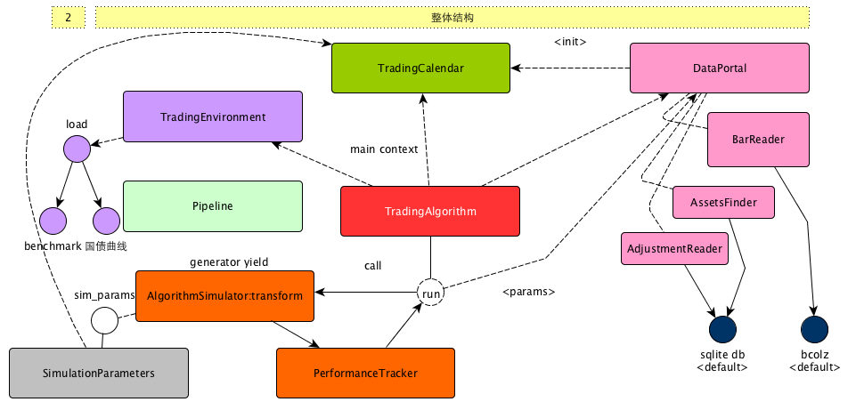

# zipline的整体架构

## 先看图

在这里可以看出，`zipline`由下面几个主要的部分构成

| 名称                 | 说明                                       |
| ------------------ | ---------------------------------------- |
| TradingAlgorithm   | 量化策略的抽象，既可以通过初始化传入构造上参数的方式，也可以通过继承的方式构造，其中`zipline`命令行主要的运行入口逻辑 `run` 方法也在这个类中 |
| TradingCalendar    | 交易日历的抽象，这个类非常重要，无论是在构建数据的过程还是运行的过程，都可以用到 |
| DataPortal         | 数据中心的抽象，可以通过这个入口获取很多不同类型的数据              |
| AlgorithmSimulator | 使用`generator`的方式，表述了策略运行过程的主循环。如果说`TradingAlgorithm`更像是代表了策略本身，那么`AlgorithmSimulator`更像是策略的执行器，尤其要关注的是他的`transform`方法 |
| TradingEnvirioment | 构造运行环境，主要是`benchmark`和`国债利率曲线`等信息，对于美国的市场，这个类基本上不太需要关注，但是对于国内的市场，我么需要构建自己的`TradingEnvironment` |

